# 📚 Conectec - Rede Social Acadêmica

O **Conectec** é uma rede social em formato de website, desenvolvida em **PHP/Laravel**, com o objetivo de construir um ambiente de conhecimento compartilhado entre os alunos da **ETEC**.

## 🚀 Sobre o Projeto

A **Conectec** permite que os alunos da ETEC interajam, compartilhem conteúdos acadêmicos e colaborem em projetos, promovendo um aprendizado dinâmico e colaborativo.

## 🎯 Funcionalidades

✅ Cadastro e login de alunos
✅ Criação de perfis personalizados
✅ Postagens e comentários
✅ Chat para comunicação direta entre alunos
✅ Feed de notícias e novidades da ETEC

## 🛠️ Tecnologias Utilizadas

- **Backend:** PHP/Laravel
- **Frontend:** Blade (Laravel Views) / Bootstrap
- **Banco de Dados:** MySQL

## 📌 Como Executar o Projeto

### 🔹 Pré-requisitos
Antes de começar, você precisará ter as seguintes ferramentas instaladas:
- PHP & Composer
- MySQL
- Git

### 🔹 Instalação
1. Clone este repositório:
   ```sh
   git clone https://github.com/seu-usuario/conectec.git
   ```
2. Acesse a pasta do projeto:
   ```sh
   cd conectec
   ```
3. Instale as dependências do backend:
   ```sh
   composer install 
   ```
4. Configure o arquivo **.env** ( Apenas crie o arquivo .env na pasta conectec, copie o conteudo do arquivo .env.example e cole no .env criado)
5. Execute as migrations e seeds:
   ```sh
   php artisan migrate --seed
   ```
6. Execute a chave:
   ```sh
     php artisan key:generate
   ```
7. Execute o storage:
   ```sh
     php artisan storage:link
   ```
8. Inicie o servidor backend:
   ```sh
   php artisan serve
   ```
9. Acesse no navegador:
   ```
   http://localhost:8000
   ```

Obs: Usar uma conta com @etec.com ao se cadastrar!!

## 🖼️ Prints das Telas

Adicione capturas de tela da aplicação aqui para melhor visualização:

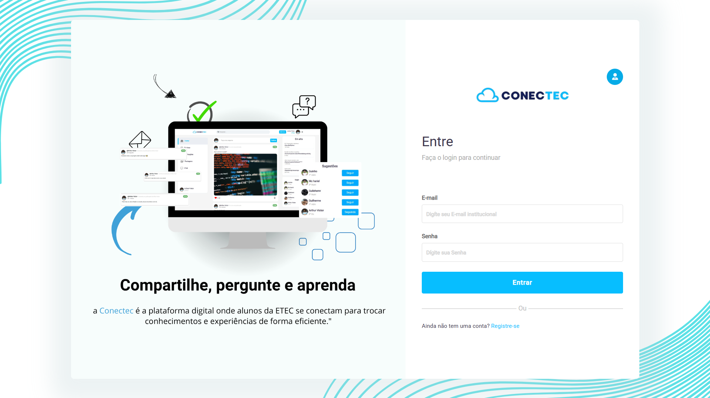
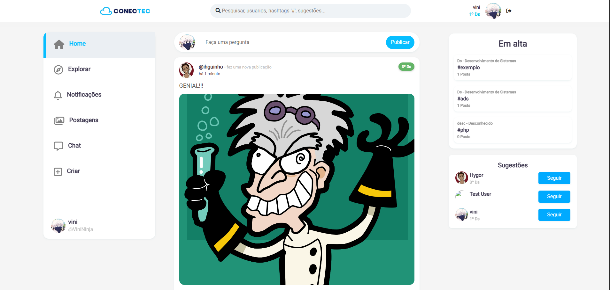
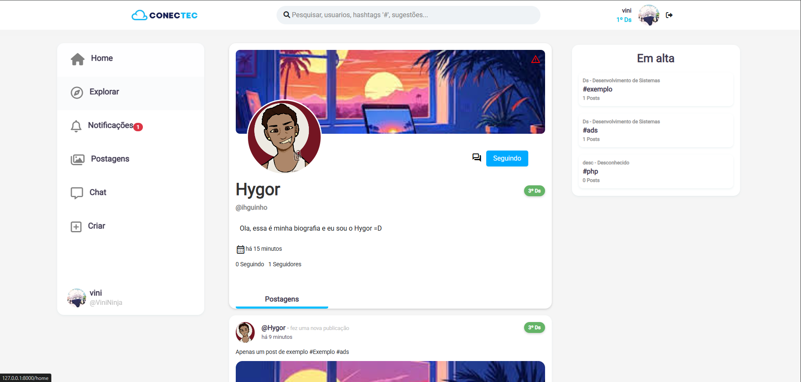
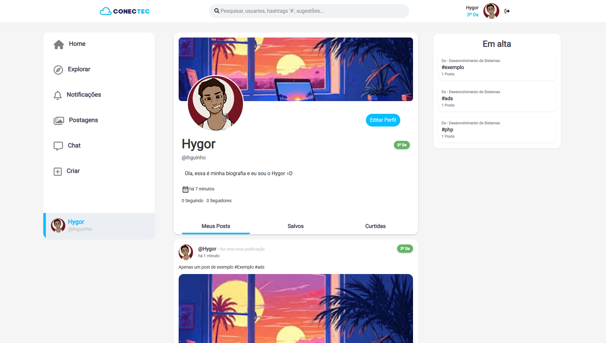
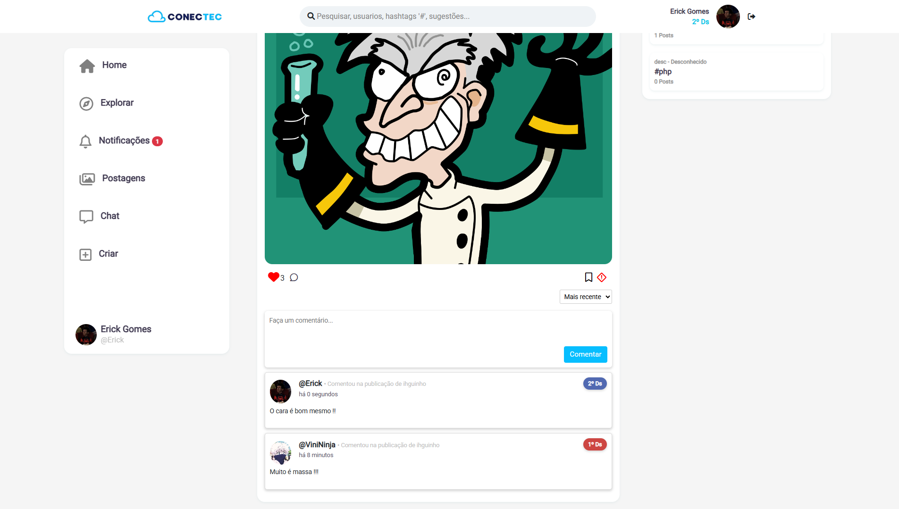
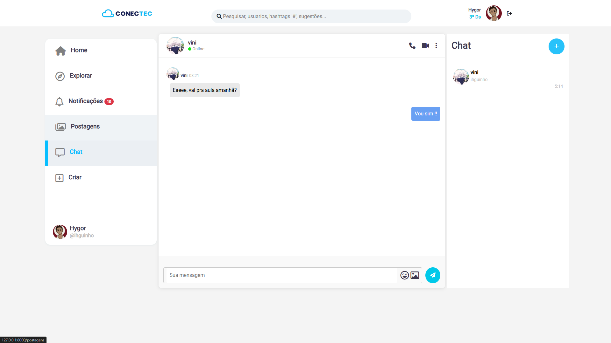
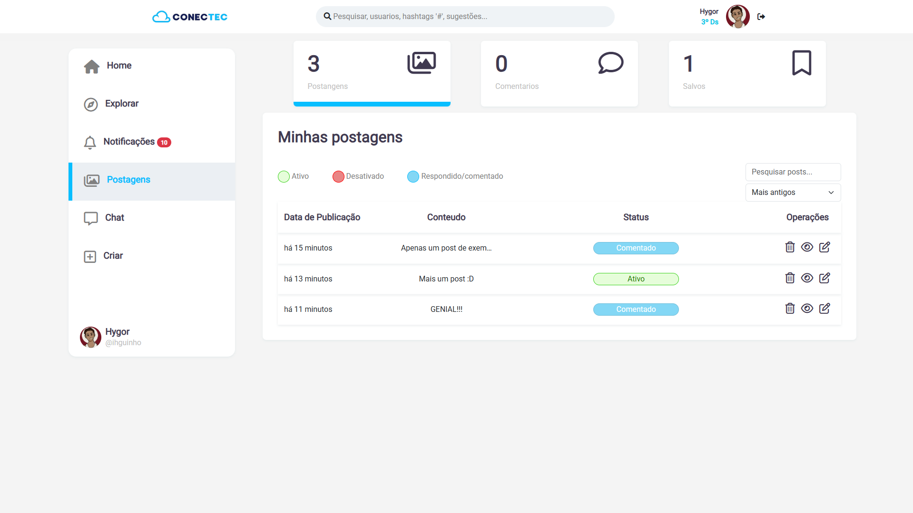
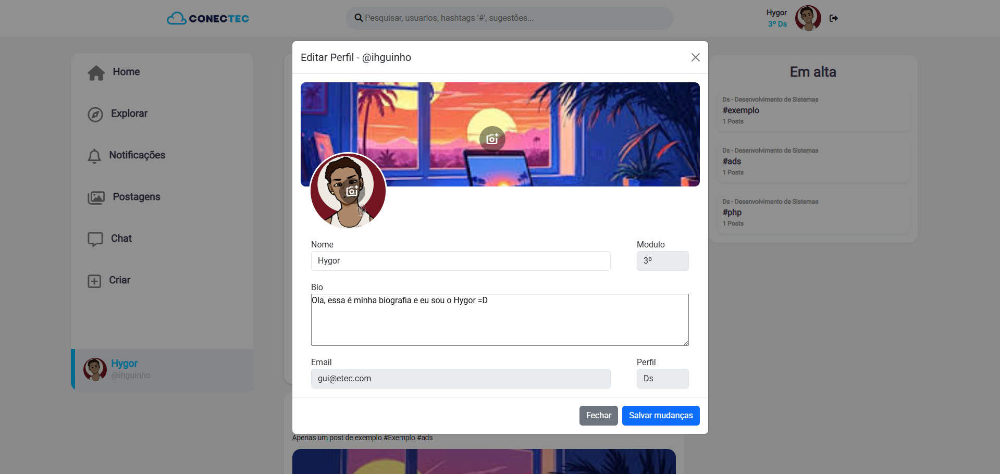
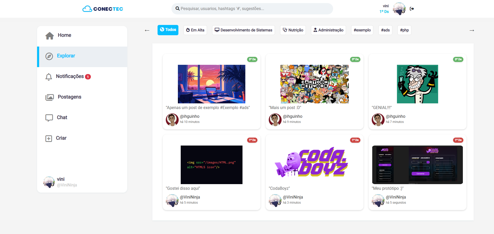
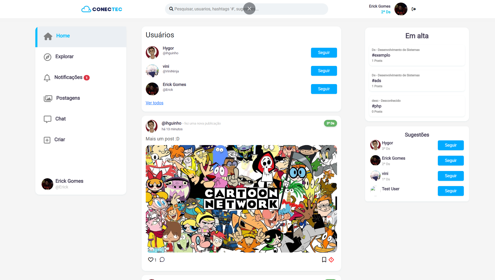
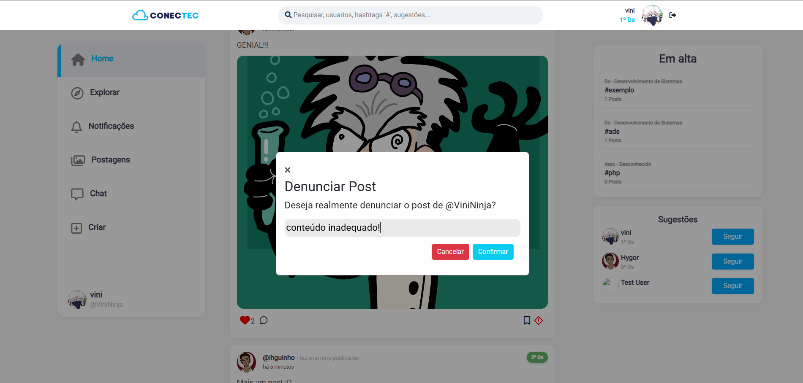
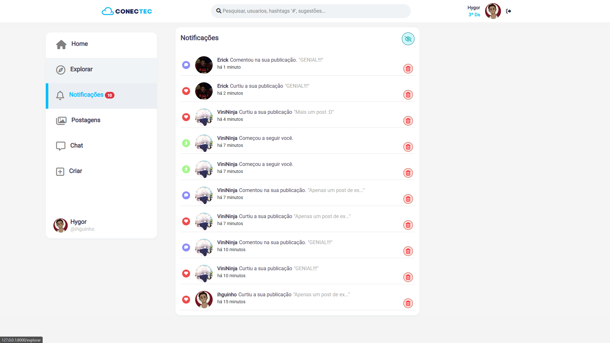
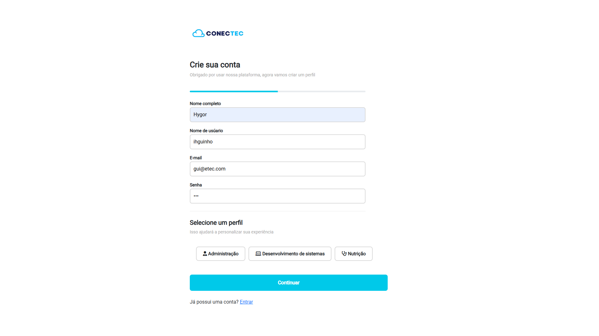
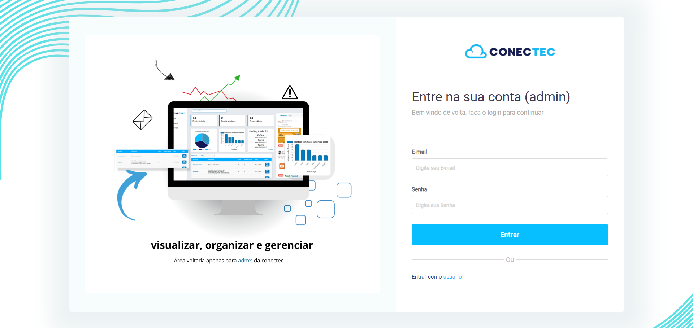
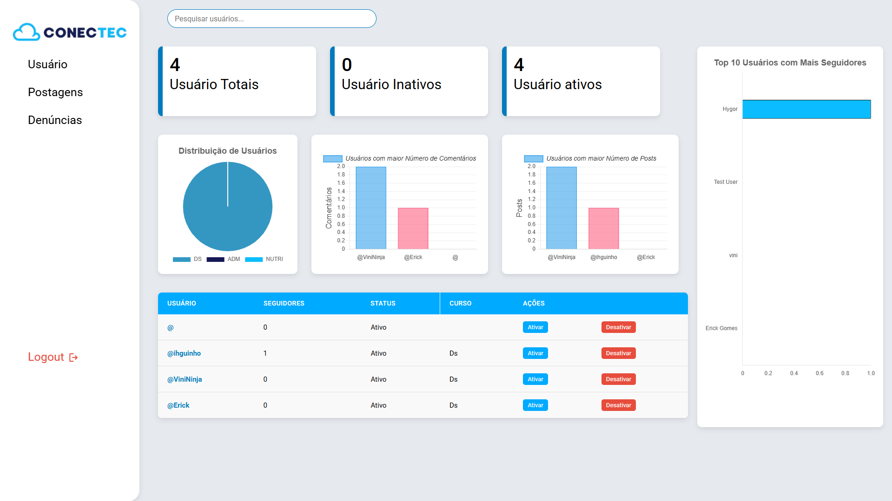
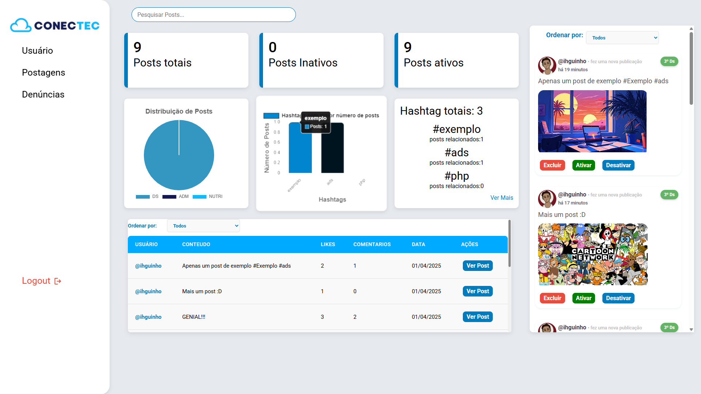


---

👩‍💻 **Desenvolvido por Chronos **

